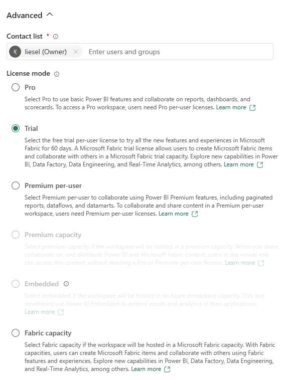
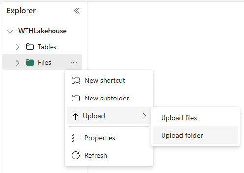
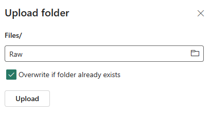
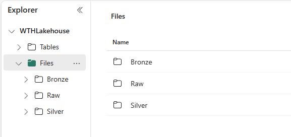

# Challenge 0 - Prerequisites - Grab your fins and a full tank!

**[Home](../README.md)** - [Next Challenge >](./Challenge-01.md)

## Introduction

Thank you for participating in the Fabric Lakehouse What The Hack. Before you can hack, you will need to set up some prerequisites.

## Prerequisites

You will need:

- A Microsoft Fabric subscription. At the time of writing, Microsoft Fabric is in public preview and a free trial is available at [aka.ms/FabricTrial](https://aka.ms/FabricTrial).

- A Microsoft Fabric enabled workspace. Either you or your organisation's administrator will need to create this. Instructions can be found at [learn.microsoft.com/en-us/fabric/get-started/create-workspaces](https://learn.microsoft.com/en-us/fabric/get-started/create-workspaces)

- Power BI desktop. This can be installed from [aka.ms/getpowerbi](https://aka.ms/getpowerbi)

- A love of terrible sea-themed puns

## Setting up your environment

You will need to complete the following steps to set up your environment:

1. Create a new workspace in Fabric (or have one created by your administrator).
2. Create a Lakehouse in your workspace.

### Create a new workspace in Fabric

If you are not familiar with Fabric workspaces, you should first read [Create a workspace](https://learn.microsoft.com/en-us/fabric/get-started/create-workspaces) on Learn. When creating your workspace, you may need set the workspace's' Fabric license.

Expand Advanced Settings and select the appropriate license. If you are using a trial subscription, select the Trial license, or select the Fabric capacity you have been assigned by your administrator.

### Create a Lakehouse in your workspace

Create a new Lakehouse in your workspace by following the instructions at [Create a Lakehouse](https://learn.microsoft.com/en-us/fabric/data-engineering/create-lakehouse).

## Success Criteria

1. You have logged into [fabric.microsoft.com](https://fabric.microsoft.com)
1. You have Power BI installed on your PC.
1. You have created a new workspace, a Lakehouse and uploaded the provided data files to your OneLake.

You're now ready to grab a tank, your fins and set sail!

----

### About that resources.zip file

You might be wondering what that ``resources.zip``  file your Coach provided you is all about? Divers always use the buddy system, and we've buddied up with you in case you hit rough water when finding Nemo during your hack.

  
But for now, spoilers! No peeking!

## Hey, we said no peeking!

### But Help! I'm lost at sea!

Your Coach has provided some data to help you out during this hack. Of course, you are free to source your own data, but if you end up in shark infested waters you can always fall back on the data provided by your Coach.

If you need it, you can upload the data (or parts of it) to your Lakehouse by following the instructions below.

#### Uploading the Data

Unzip the ``resources.zip`` file provided by your coach. In your new Lakehouse, click on the ``...`` menu next to the ``Files`` item and select ``Upload -> Upload Folder``

Navigate to the folder containing the unzipped resources and select the folder to upload (in this case Raw). Click Upload.

Repeat for any of the other folders.

